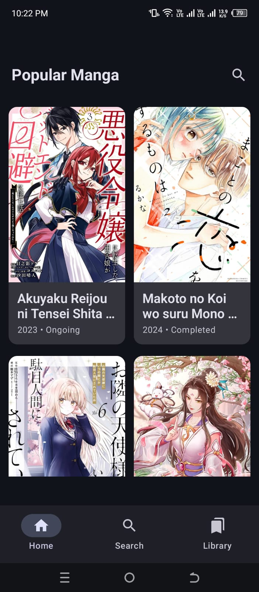

<h1>MangaDex Reader</h1>

**Beautiful, modern, smooth manga reader app for MangaDex using Jetpack Compose**

 

## 📱 Screenshots

  <table>
    <tr>
      <td></td>
      <td></td>
      <td></td>
      <td></td>
    </tr>
  </table>

 

## ✨ Features

- **Modern Material 3 UI** with dynamic theming support
- **Smooth horizontal pager reader** with pinch-to-zoom & double-tap zoom
- **Pull-to-refresh** on home screen
- **Shimmer loading** effect for images
- **Fixed top bar** with chapter info & page counter
- **Favorites / Library** tab (in-memory for now)
- **Robust error handling** with retry buttons
- **Clean architecture** (data → repository → presentation)
- **Jetpack Compose Navigation** with bottom navigation bar
- **Coil** for fast & cached image loading

 

## 🛠️ Tech Stack

| Category             | Technology                                 |
|----------------------|--------------------------------------------|
| UI                   | Jetpack Compose, Material 3                |
| Architecture         | MVVM + Clean Architecture                  |
| Networking           | Retrofit + Gson                            |
| Image Loading        | Coil Compose                               |
| State Management     | StateFlow + UiState sealed class           |
| Navigation           | Navigation Compose                         |
| Coroutines           | Kotlin Coroutines + viewModelScope         |
| API                  | MangaDex v5 API                            |

 
